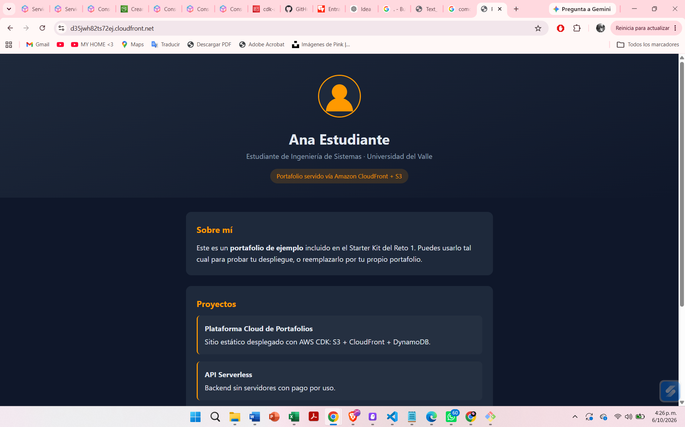

# Arquitectura — Plataforma de Portafolios Estudiantiles

---

## 1. Descripción general de la arquitectura

La plataforma es 100 % serverless y se define con AWS CDK en un único stack. Está compuesta por cuatro servicios:

- **Amazon S3** guarda los archivos del portafolio en un bucket privado.
- **Amazon CloudFront** es el único punto de entrada público: sirve el contenido con caché global y es el único servicio autorizado para leer del bucket.
- **Amazon DynamoDB** guarda los metadatos de cada portafolio (estudiante, fecha, URL). No participa en la ruta de lectura del sitio: es un registro de datos independiente.
- **AWS IAM** define dos roles separados: uno que solo escribe en S3 y otro que solo lee en DynamoDB.

**Flujo de lectura pública:** el usuario pide la URL de CloudFront por HTTPS → CloudFront responde desde caché o, si no la tiene, obtiene el objeto de S3 mediante Origin Access Control (OAC) → el usuario recibe el contenido.

**Flujo de lectura privada:** el usuario pide `/private/<archivo>` con una URL firmada → CloudFront valida la firma contra la llave pública registrada → si es válida y vigente, sirve el archivo; si no, responde 403.

**Flujo de escritura:** un principal que asume el rol `PortfolioUploaderRole` sube archivos al bucket; los metadatos se registran en DynamoDB.

**Acceso directo a S3:** cualquier petición directa a la URL del bucket devuelve 403.

---

## 2. Componentes

| Componente | Servicio AWS | Responsabilidad | Decisiones de diseño |
|---|---|---|---|
| Almacenamiento | S3 | Guarda HTML, CSS, imágenes y PDFs del portafolio. **Privado**: acceso público bloqueado (`BLOCK_ALL`). Los archivos públicos van en la raíz y los privados bajo `private/`. | Cifrado en reposo SSE-S3. `enforce_ssl=True` rechaza peticiones sin HTTPS. `removal_policy=DESTROY` y `auto_delete_objects=True` permiten que `cdk destroy` limpie todo sin pasos manuales. Un solo bucket con prefijo `private/` evita duplicar infraestructura. |
| CDN | CloudFront | Sirve el contenido con baja latencia y caché. Accede al bucket privado mediante **OAC**. Redirige todo a HTTPS y usa `index.html` como objeto raíz. | OAC en lugar de OAI (es el mecanismo vigente recomendado por AWS). **Price Class 200** (América, Europa y Asia). Behavior adicional `private/*` con Key Group para URLs firmadas. |
| Metadatos | DynamoDB | Registra estudiante, fecha y URL de cada portafolio. Incluye un ítem de prueba creado en el mismo despliegue mediante un Custom Resource. | Clave de partición: `studentId` (String). Billing mode: `PAY_PER_REQUEST` (on-demand), sin capacidad que pagar sin uso. `removal_policy=DESTROY`. |
| Permisos | IAM | `PortfolioUploaderRole`: solo escribe objetos en el bucket. `PortfolioMetadataReaderRole`: solo lee la tabla. Ambos definidos en el stack, sin recursos manuales. | Dos roles separados por función (mínimo privilegio). Se crean con `grant_put` y `grant_read_data`, que generan políticas acotadas a los ARN de este bucket y esta tabla. Sesión máxima de 1 hora. |

---

## 3. Seguridad y acceso

**¿Cómo garantizas que el bucket no sea accesible directamente (403)?**
El bucket tiene `BlockPublicAccess.BLOCK_ALL`, así que no admite políticas ni ACLs públicas. Su única política concede lectura al servicio CloudFront, y solo para esta distribución. Cualquier otra petición directa recibe 403.

**¿Cómo accede CloudFront al bucket privado?**
Mediante **Origin Access Control (OAC)**. CDK crea la política del bucket que permite `s3:GetObject` al principal `cloudfront.amazonaws.com`, condicionada al ARN de la distribución. Así, ninguna otra distribución o cuenta puede leer el bucket.

**¿Qué permisos mínimos otorgaste en IAM?**

| Rol | Permisos | Alcance |
|---|---|---|
| `PortfolioUploaderRole` | Escritura de objetos (`s3:PutObject` y acciones de subida) | Solo el bucket del portafolio. Sin lectura ni borrado. |
| `PortfolioMetadataReaderRole` | Lectura (`GetItem`, `Query`, `Scan`, `BatchGetItem`, `DescribeTable`) | Solo la tabla de portafolios. Sin escritura. |

**Otras medidas:**

- Todo el tráfico se fuerza a HTTPS (CloudFront y política del bucket).
- Cifrado en reposo en S3 (SSE-S3) y DynamoDB (cifrado por defecto).
- La llave privada de firma nunca se incluye en el stack ni en el repositorio; solo se despliega la llave pública. `private_key.pem` está en `.gitignore`.
- Limitación conocida: los roles son asumibles por toda la cuenta (`AccountRootPrincipal`). En producción se restringirían a usuarios o grupos concretos.

---

## 4. Flujo de despliegue

- Lenguaje elegido para CDK: `Python`
- Comando(s) para desplegar:

```bash
cd cdk
cdk bootstrap                                   # una vez por cuenta/región
cdk synth                                       # valida el template
cdk deploy                                      # despliegue base
cdk deploy -c public_key_file=public_key.pem    # con archivos privados (Boss Fight)
```

- Comando(s) para destruir:

```bash
cd cdk
cdk destroy
```

`auto_delete_objects=True` vacía el bucket automáticamente y `removal_policy=DESTROY` elimina bucket y tabla. Se puede verificar en CloudFormation que el stack ya no exista.

**Resultados del despliegue (completar):**

- URL de CloudFront: `https://<completar>.cloudfront.net`
- Nombre del bucket: `<completar>`
- Nombre de la tabla: `<completar>`

**Pruebas de aceptación**

| Prueba | Resultado esperado |
|---|---|
| Abrir la URL de CloudFront | Se muestra el portafolio. |
| Abrir directamente la URL del bucket S3 | Error 403. |
| `cdk synth` | Template generado sin errores. |
| `aws dynamodb scan --table-name <TableName>` | Aparece el ítem de prueba. |
| Pedir `/private/<archivo>` sin firma | Error 403. |
| Pedir `/private/<archivo>` con URL firmada válida | Se devuelve el archivo. |

---

## 5. Boss Fight

**¿Cómo manejaste los archivos privados (signed URLs)?**
Con **CloudFront Signed URLs**. Se genera un par de llaves RSA; la pública se registra en CloudFront (`PublicKey`) y se agrupa en un `KeyGroup`, que se asigna como `trusted_key_groups` a un behavior adicional con patrón `private/*`. Cualquier petición a ese prefijo exige una URL firmada con la llave privada, que se conserva fuera del repositorio. Se eligió esta opción sobre las S3 Presigned URLs porque la firma se valida en el edge y el bucket permanece 100 % privado detrás de OAC.

**¿Qué Price Class configuraste y por qué?**
`PRICE_CLASS_200`, que cubre América, Europa y Asia (los tres mercados que pide el cliente) sin pagar por la clase All. Price Class 100 no incluye Asia, así que habría dejado a esos usuarios con mayor latencia.

**¿Cómo conviven archivos públicos y privados en tu diseño?**
En el mismo bucket y la misma distribución, separados por prefijo. El behavior por defecto sirve el contenido público sin firma; el behavior `private/*` exige URL firmada. No hubo que modificar los recursos existentes, por lo que lo anterior sigue funcionando. El behavior privado es opcional: solo existe si se despliega con `-c public_key_file=...`.

## **evidencias**

acceso denegado por parte del bucket s3, al intentantar acceder alñ index.html del proyecto.


acceso al portafolio web desde la url generada por el deploy del proyecto.



se muestra que los servicios fueron creados correctamente en la plataforma de aws.


demostracion de que se deniega el acceso a otros archivos fuente del proyecto, solamente dejando ver lo que les permitimos ver.


se almacenaron correctamente los metadatos dentro de la base de datos dynamodb..
